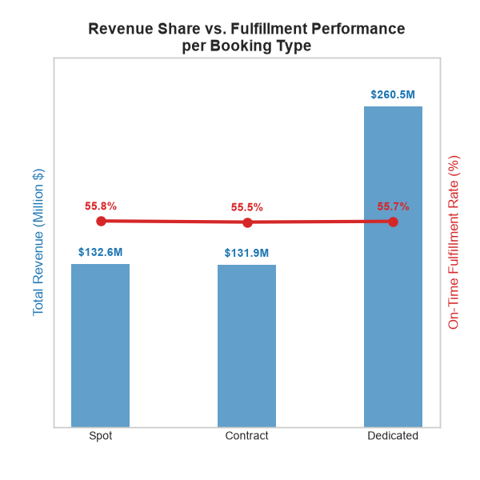
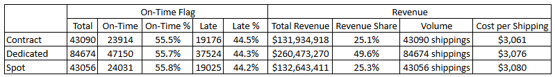
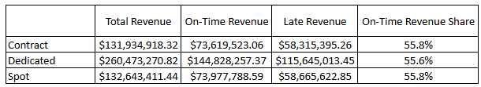
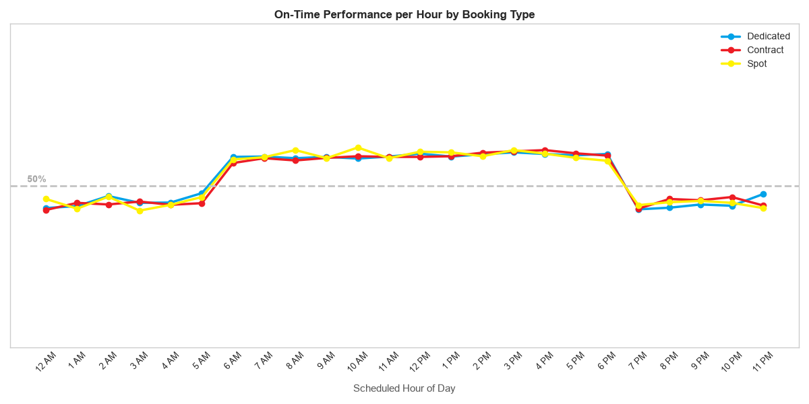

  <h1>Kaggle Dataset Realism and Value to Data Analysis Audit</h1>

<h2>Background</h2>

Kaggle is the usual go-to repository of aspiring and practicing data professionals where they can browse and download datasets to be used to learn and hone their skills. The main problem with many datasets that are accessible is that the data is mostly artificially generated and can be a poor imitation of the data that is being handled in the corporate environment. Although a sample dataset should not be used as an exact basis for the real world data, it should be realistic to be of better help to those who are planning to use said dataset for data analysis. The main problem that aspiring data analysts on Kaggle face are the overly synthetic and sanitized datasets that are not only generic when it comes to insights you can get, some are also unrealistic. 

The title of the dataset from Kaggle that will be used is "Logistics Operations Database" (https://www.kaggle.com/datasets/yogape/logistics-operations-database) where the author claimed that, 

"Most logistics datasets are either proprietary (unavailable) or overly simplified (unrealistic). This fills the gap: operational complexity without confidentiality concerns."

The dataset contains several sheets but the project will utilize two (sheets) that contain details regarding the subject company's performance: delivery events and truck load. The project will not focus on the in-depth analysis of the dataset, rather an investigation of the author's claim regarding how the dataset can fill the gap of unrealistic data that is exhibited by most Kaggle datasets.  

<h2>Executive Summary</h2>

  

The project is aimed to verify the dataset's author's claim regarding: "Most logistics datasets are either proprietary (unavailable) or overly simplified (unrealistic). This fills the gap: operational complexity without confidentiality concerns.", and assess the value it can provide for data analysis. 

<h3>Primary Insights:</h3>

 - The dataset contains an even data, the fulfillment performance regardless of the dimensions (columns) used and booking type is generally just about 55% on-time and 45% late which implies a flaw on the operational baseline.

 - The dataset lacks real-world nuance and, dimensions such as Booking Types, Scheduled Date - Month of Year, etc. are found to be insignificant in affecting the fulfillment performance when in reality, these two (2) are some of the main drivers. Furthermore, the dataset exhibits seemingly perfect, clean and too controlled data, additionally, the abrupt shift in the fulfillment performance was found when investigating the Scheduled Date - Hours of Day does not appear to be a reflection of real human behavior.

 - Overall, the data is more on the unrealistic side and is falling short on achieving the promise of its author regarding filling the gap about operational complexity.

<h3>Recommendation:</h3>

 - Use this dataset if the objective is to practice data manipulation with data cleaning as the only exception.

 - Avoid using a dataset like this if the goal is to catch a glimpse of how logistics work in real-world.

 - Approach with caution when using the dataset for building predictive models as the data in synthetic and the resulting model might not be suitable for real-world application.

<h2>Methodology</h2>

With the combined sheets from the dataset having 22 columns, it is necessary to narrow these down into significant columns for analysis. The project will use the company's fulfillment performance as the main subject of the audit, as this is one of the essential KPIs of logistics. Furthermore, the dataset has three (3) booking classifications: Spot, Contract, and Dedicated, though not explicitly mentioned, there should be a degree of difference between these three (3) different classes especially when it comes to fulfillment performance as Spot bookings are generally less prioritized compared to the other two (2).

<h3>General View</h3>

  

Across the three (3) booking types, the fulfillment performance is even with 55% of the shipments are fulfilled on time while the other 45% is fulfilled late. Based on the total revenue from shipments, Dedicated bookings make the half of the revenue while the other half is almost evenly shared by Contract and Spot, despite this massive share in revenue, no significant difference in terms of fulfillment performance can be observed which is an oddity. A logistics company that earned $525,051,600 from 2022-2024, is almost 50/50 when it comes to fulfilling their shipments on time is a little bit far from being realistic, a 55% on-time fulfillment rate is not acceptable even for Spot bookings, let alone for bookings with pre-existing agreement like Contract and Dedicated, furthermore, the Cost per Shipping across almost booking types are almost the same.

<h3>Null Values Check</h3>

There are no null values present across all the 170,820 rows in 22 columns. The dataset itself is too clean although is not too unrealistic as the author is trying to mimic a data from an established company in which it is to be expected that the data is particularly clean but not this perfect. Based on this, the dataset can be used instantaneously with minimal cleaning though it might not be a good choice for those who want to practice with data cleaning.

<h3>Column Significance</h3>

To identify the columns that are significant to fulfillment performance, the Chi-Square test will be used, as the main metric that will be measured is if the order was fulfilled on-time or late which are categorical variables, not the severity of late. Upon conducting the test, the columns that impact (p-value <= 0.05) the fulfillment performance were: 

- Event Type				- if the fulfillment is handled through client pick up or delivery

- Scheduled Date			- the expected date when client should receive the order

- Detention Minutes			- the facility-level delay experienced by the truck drivers

- Location City & Location State	- location of the destination

Surprisingly, Booking Type has a value close to one (1), indicating its insignificance in affecting fulfillment performance, which is a major red flag as prior figures have shown the disparity of revenue share that the booking types have.

  

<h2>Significant Columns In-Depth</h2>

<h3>Event Type</h3>

With the p-value of flat 0, the Event Type or the clients' decision whether to arrange the shipment pick up by themselves or get it delivered to them, heavily affects the fulfillment performance. Pickup shipments tend to have better fulfillment performance, though it heavily depends on the clients' ability to pick their shipment on-time as opposed to the company’s ability to deliver the orders, which almost half the customers receive their orders late due to the company’s delivery system. 

<h3>Detention Minutes</h3>

For the time spent by the drivers on the facility, an even distribution can also be observed, additionally across all customer types, failure rate increases slightly if courier is held for more than 1 hour in detention, though overall, the performance is still far from satisfactory. The column has a very low p-value, which means it impacts fulfillment performance.

<h3>Scheduled Date</h3>

Scheduled Date was segmented into 3 sub-categories, Month Year (ex. May 2020), Days of Week (ex. Monday), Hours of Day (ex. 12 PM). Upon running the chi square test, the corresponding p-values indicate that the Month Year is not affecting the fulfillment performance, indicating insignificance of seasons in fulfillment performance, while Days of Week and Hours of Day do. The performance distribution on Days of Week is uniform with the exception of Tuesdays being slightly better (56% vs 44% instead of the usual 55%vs45%) across all customer types, though a very minor shift. The Hours of the Day column has shown a different perspective of the fulfillment performance; orders are being fulfilled mostly on-time from 6 AM - 6 PM of the day and are fulfilled late outside of that range.  

  

Even though the on-time fulfillment can go up to 60%, the heavy presence 55%vs45% fulfillment performance still indicate it being the operational baseline as the nature of the performance drop is instant, it flips at the same time ranges instead of gradually getting worse across all customer types. As the dates are based on the promised or the “Scheduled”, this indicates a possible presence of logistical problems within the timings that lead to 7 PM to 5 AM, possible reasons could be, unrealistic designation of target dates and drivers completing their backlogs which start a chain reaction of fulfillment performance deterioration, or a deliberate setting by the author that might have failed to consider to mimic human behavior.

<h3>Location City and State</h3>

The distribution of fulfillment performance could be as low as 46%vs54% up to 68%vs32%. The on time cities are also similar on Dedicated, Contract and Spot customers with the exception of Detroit and Denver where Denver orders are mostly on-time only for Spot customers while Detroit orders are mostly on-time only for Dedicated and Contract customers, it can also be observed for their states where Colorado orders (where Denver is located) are mostly on-time for Spot customers and Michigan (where Detroit is located) are mostly on-time for Dedicated and Contract customers. The same two (2) cities and states that have mostly late fulfillment across all customer types are Indianapolis (IN) and Los Angeles (CA). 

<h2>Conclusions and Recommendations</h2>

- Booking Type Insignificance: Booking Type does not affect fulfillment performance when it otherwise should, though ideally, all booking types should receive the same level of prioritization, it is not something that logistics companies can actively maintain or even want to actively maintain, but in practicality, the highest level of prioritization should be given to where the most revenue is coming from, in the case of this dataset, on the Dedicated bookings.

- Operational Shortcomings: The majority of the fulfillment performance is 55%vs45%, exhibited across the metrics used to investigate. This is practically a hit or miss performance for a logistics company that has gone on for several years (2022-2024) uncorrected.

- Controlled Level of Variance: The fulfillment performance can go as low as 46% on-time and as high as 68% on-time, considering that the standard fulfillment performance is 55% on-time, these outliers are not straying away from being realistic, additionally, the logistics company treats the Booking Types too similarly.

- Lack of Real-World Hindrance: Seasons having no effect on logistics is possible but very rare. While it can be true that once a logistics company has optimized their process, seasons barely matter in their performance, the standard 55% on-time fulfillment rate is not a sign of an optimized process.

- Synthetic Behavior: The abrupt shift of fulfillment performance saw when based on Scheduled Date - Hours of Day, does not seem like a spontaneous human behavior (which is usually exhibited by slow decline rather than sudden shift).

* The dataset is clean enough to be used right away with minimal cleaning needed thus is not helpful if going to be used for Data Cleaning practice.

* The dataset can lead to many insights although not very conducive in developing or giving an overview on how actual logistics companies work.

* The dataset can be used for practicing data manipulation techniques outside of data cleaning.

* The dataset can be utilized in building predictive models, especially using the other sheets, however, it is important to note this dataset seems to have been generated synthetically, which could result to a model with high accuracy but unusable in real world logistics.

